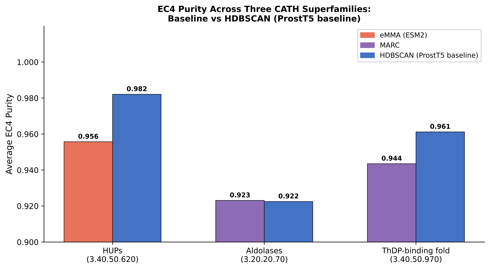
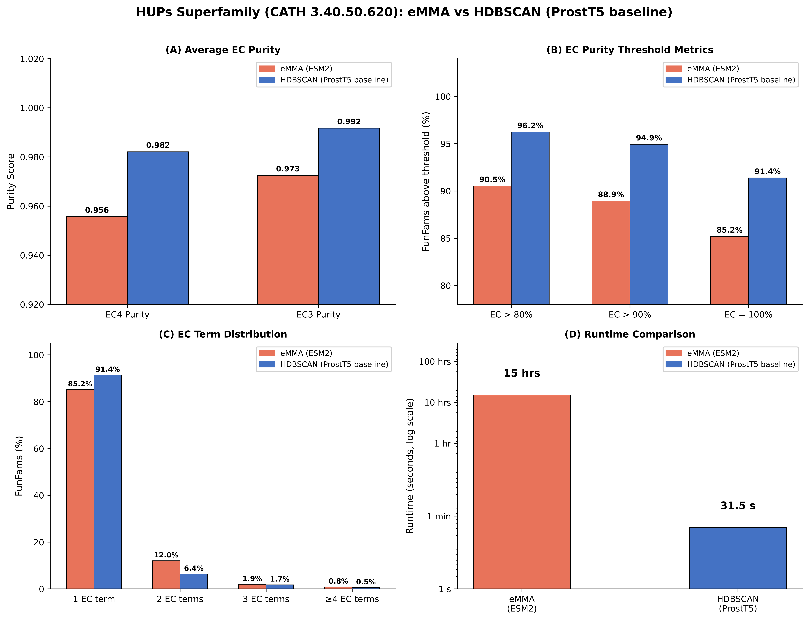
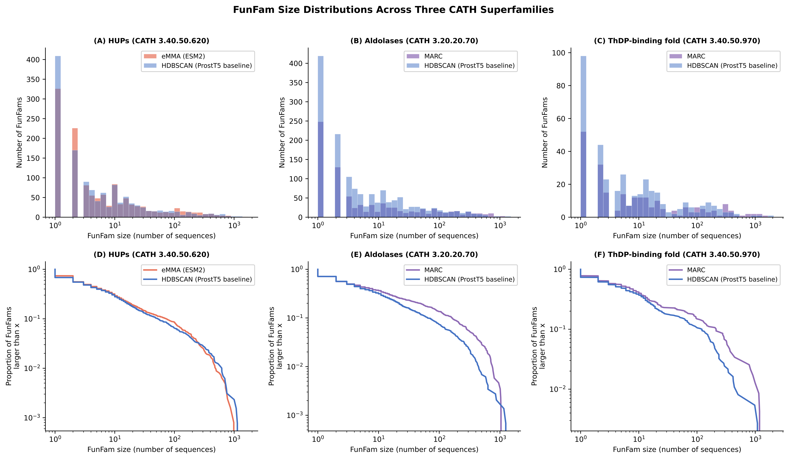
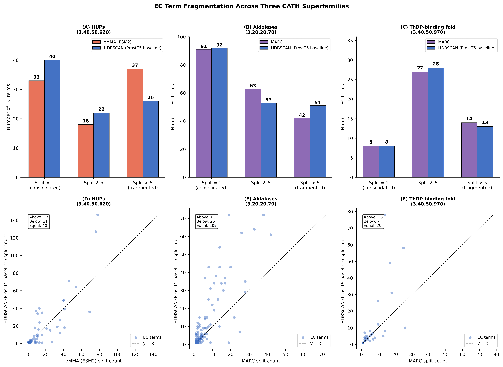
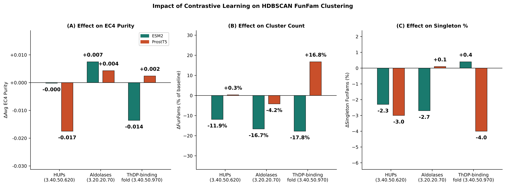

# Results

Figures from the MSci report, generated by HDBSCAN clustering and contrastive learning experiments across three CATH superfamilies (HUPs 3.40.50.620, aldolases 3.20.20.70, ThDP-binding fold 3.40.50.970). All code used to plot figures in Jupyter Notebook attached.

---

## Figure 3 — Average EC4 purity across three superfamilies

Comparison of average EC4 purity between HDBSCAN (ProstT5 baseline) and the respective reference method (eMMA for HUPs, MARC for aldolases and ThDP-binding fold). HDBSCAN achieves comparable or higher purity in all three cases.

*Report section: Results — "HDBSCAN achieves comparable or superior functional purity"*  

---

## Figure 4 — Detailed evaluation of HDBSCAN in the HUPs superfamily

(A) Average EC4 and EC3 purity for eMMA vs HDBSCAN. (B) Proportion of FunFams exceeding EC4 purity thresholds of 80%, 90%, and 100%. (C) Distribution of FunFams by number of distinct EC annotations. (D) Runtime comparison on a log scale (31.5s vs ~15 hours).

*Report section: Results — "HDBSCAN achieves comparable or superior functional purity"*  

---

## Figure 5 — FunFam size distributions across three superfamilies

Log-scale histograms (upper) and complementary cumulative distribution functions (lower) of FunFam sizes for each superfamily, comparing HDBSCAN against the reference method. HDBSCAN consistently produces more, smaller FunFams.

*Report section: Results — "HDBSCAN achieves comparable or superior functional purity"*  

---

## Figure 6 — EC term fragmentation across three superfamilies

(Upper) Number of EC4 terms with split count = 1, 2–5, or >5 across superfamilies. (Lower) Per-EC-term scatter plots comparing split counts between methods; points below the diagonal indicate EC terms more consolidated in HDBSCAN.

*Report section: Results — "HDBSCAN achieves comparable or superior functional purity"*  

---

## Figure 7 — Impact of contrastive learning on HDBSCAN clustering

(A) Change in average EC4 purity after contrastive fine-tuning for ESM2 and ProstT5 embeddings. (B) Percentage change in total FunFam count. (C) Change in singleton FunFam proportion. ESM2 contrastive embeddings consistently reduce FunFam count; purity effects are small and inconsistent.

*Report section: Results — "Contrastive learning produces modest and inconsistent effects on functional purity"*  
